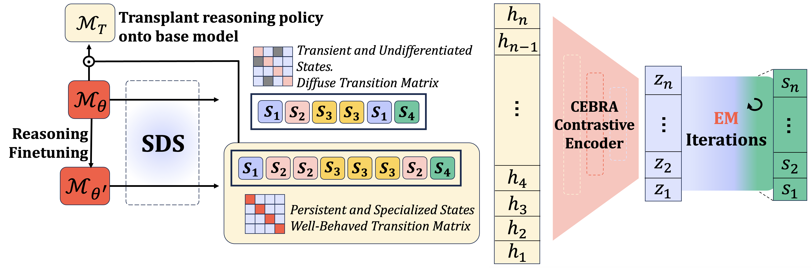

# Reasoning Policy Controllers in Fine-Tuned Models

<p align="center">
  
  
  
  
</p>



This repository implements the methods behind the COLM 2026 paper *"Reasoning Fine-Tuning Induces Persistent Latent Policy States"*.

TL;DR: given a reasoning model and its sentence-level hidden-state trajectories, this code discovers discrete latent policy states, measures how persistent they are, and tests whether those states can be transplanted onto a base model to steer reasoning behavior.

## Contents
- `contrastive_gen/` — reusable CEBRA-based encoder, dynamics model, training, and API helpers
- `analysis/` — scripts for dataset extraction, regime discovery, causal steering, and transplantation analysis
- `experiments/` — structured paper experiments, ablations, and evaluation utilities
- `generate_data/` — dataset creation and feature extraction helpers
- `scripts/` — Hugging Face utilities and repository management helpers

## 🔧 Dependencies and Installation
All commands in this README are run from the repository root.

```bash
git clone https://github.com/withmartian/mi-cot.git
cd mi-cot
python3 -m venv .venv
source .venv/bin/activate
python3 -m pip install --upgrade pip
python3 -m pip install -r requirements.txt
```

Minimum recommended Python version: `>= 3.10`.

## 🧠 How this repo works
1. `contrastive_gen.load_features()` loads hidden-state trajectories and builds training triplets.
2. `contrastive_gen.standardize_hidden_states()` scales activations into a model-ready tensor.
3. `contrastive_gen.train_k_regime_model()` trains a discrete latent regime encoder plus dynamics model.
4. The learned regime assignments are evaluated for persistence, transition structure, and causal transplant effects.

This is a paper repository, not a model hub: it provides the code and analysis pipeline used to reproduce the reasoning policy controller experiments.

## 📦 Released artifacts
This repo releases code only.

The main runnable components are:
- `contrastive_gen/` — API for training and saving regime models
- `analysis/` — dataset assembly, feature extraction, steering, and evaluation scripts
- `experiments/` — paper experiments and ablations
- `scripts/` — utility scripts for repository management and Hugging Face interaction

## 📥 Loading the API
```python
from contrastive_gen import (
    load_features,
    standardize_hidden_states,
    train_k_regime_model,
    save_model_artifacts,
)
```

## 🚀 Quickstart
```python
from contrastive_gen import load_features, standardize_hidden_states, train_k_regime_model, save_model_artifacts

features, triplets = load_features("rpc_dataset/all_sentences_features.pkl")
X_torch, scaler = standardize_hidden_states(features)
result = train_k_regime_model(K=4, features=features, triplets=triplets, epochs=50)

print("Persistence:", result["persistence"])
print("Sequence count:", len(result["sequences"]))

save_model_artifacts("out/cebra_model", result)
```

## 📊 Reproducing the paper workflow
### 1. Prepare data
Use `analysis/gen_rpc_base.py` to extract hidden-state features from a base model.

### 2. Train a regime model
Use `contrastive_gen.train_k_regime_model()` to learn discrete latent states from sentence activations.

### 3. Analyze policy structure
Recover state sequences and persistence scores with:
```python
from contrastive_gen import build_state_sequences, compute_persistence

sequences = build_state_sequences(features, result["states"])
persistence = compute_persistence(sequences)
print(persistence)
```

### 4. Run causal and steering experiments
Use scripts in `analysis/` to run transplant and steering studies, including:
- `analysis/cebra_EM.py`
- `analysis/rpc.py`
- `analysis/cebra_em_steering_inputDep.py`

## Optional workflows
- `experiments/` contains structured paper experiments and ablations
- `generate_data/` contains dataset creation utilities
- `analysis/` contains example pipelines for feature extraction and steering

## 🎯 High-level API
The core API is exposed through `contrastive_gen`:
- `load_features(path, ...)`
- `standardize_hidden_states(features)`
- `train_k_regime_model(K, features, triplets, ...)`
- `build_state_sequences(features, states)`
- `compute_persistence(sequences)`
- `save_model_artifacts(path, artifacts)`

## 📜 Citation
If you use this code, please cite:

> Harrasse, A., et al. (2026). *Reasoning Fine-Tuning Induces Persistent Latent Policy States*.
